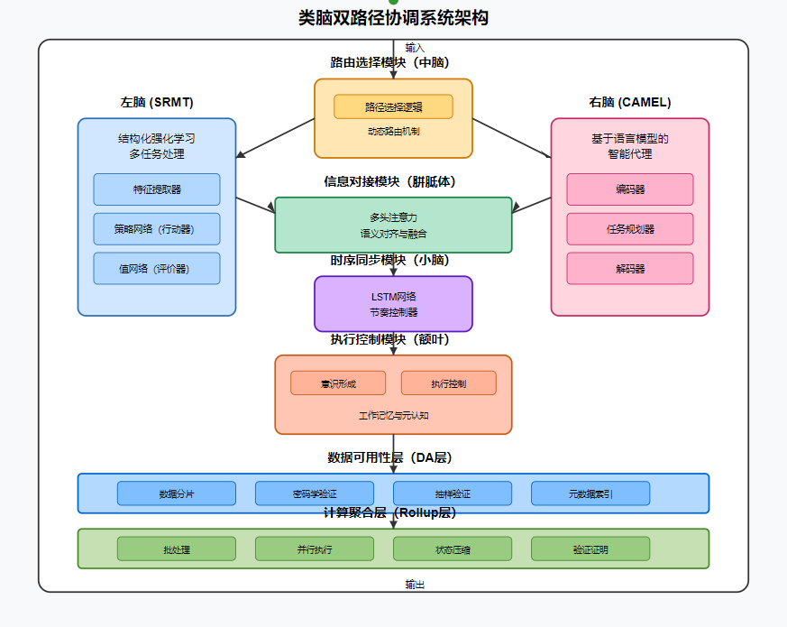
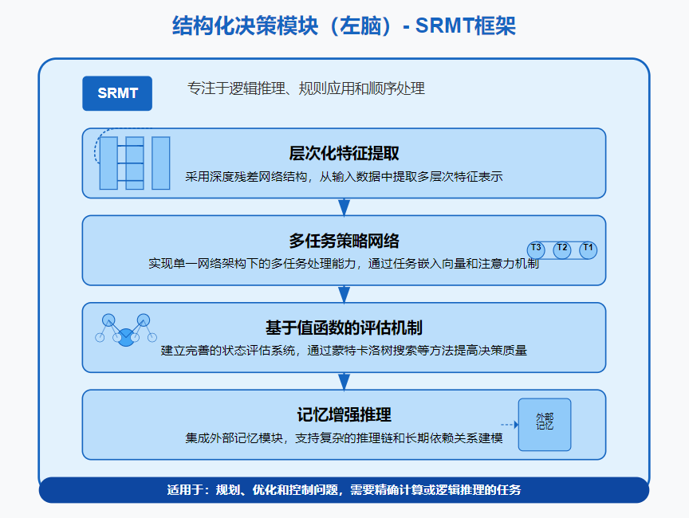
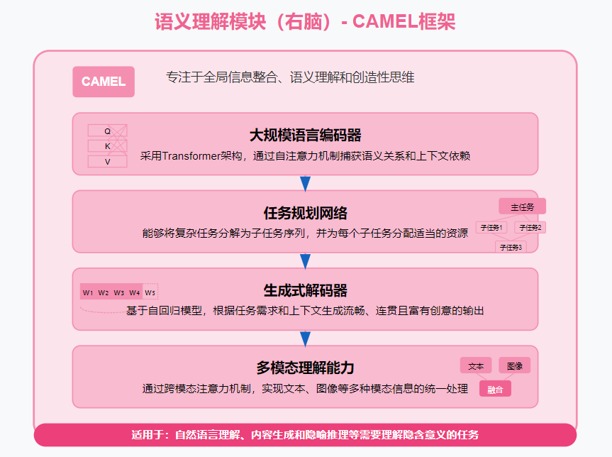
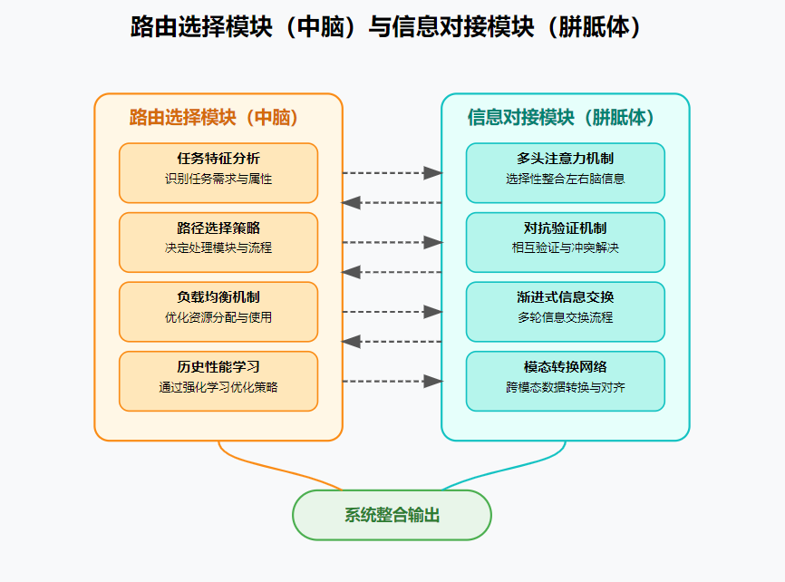
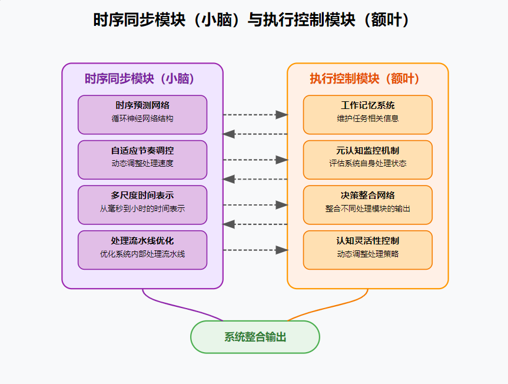

# DPCS-B: 双路径协调系统 (Dual Path Coordination System)

[](https://www.python.org/downloads/)
[](https://pytorch.org/)
[](LICENSE)

基于脑科学启发的双路径协调系统，集成区块链技术的创新计算架构。

## 系统概述

双路径协调系统(DPCS-B)采用模块化设计理念，将脑科学启发的计算架构与区块链技术有机集成。系统架构分为三层：

1. **计算层**：包含六大神经认知模块
   - 左脑（结构化强化学习模块）
   - 右脑（语义理解与语言生成模块）
   - 中脑（路由选择器）
   - 胼胝体（信息融合模块）
   - 小脑（时序同步模块）
   - 额叶（执行控制模块）

2. **数据层**：由数据可用性层(DA)和计算聚合层(Rollup)组成

3. **接口层**：提供用户交互、API调用和外部系统集成能力

## 核心特性

- **动态路径选择**：通过中脑模块实现任务特征分析和路径自适应选择
- **多模态处理**：支持结构化数据和非结构化文本的双路径协同处理
- **信息融合机制**：通过胼胝体模块实现跨模态信息对齐与融合
- **区块链集成**：提供数据透明性和处理可验证性
- **元认知能力**：具备对处理质量的自我评估机制

## 安装指南

### 基本安装

```bash
# 克隆仓库
git clone https://github.com/MK60DN/dpcs-b.git
cd dpcs-b

# 创建并激活虚拟环境
python -m venv venv
source venv/bin/activate  # Windows: venv\Scripts\activate

# 安装基本依赖
pip install -e .
```

### 完整安装（包含所有功能）

```bash
pip install -e .[all]
```

### 按需安装

```bash
# 仅区块链功能
pip install -e .[blockchain]

# 仅用户界面
pip install -e .[ui]

# 仅示例代码
pip install -e .[examples]

# 开发环境
pip install -e .[dev]
```

## 快速入门

### 运行内置示例

```bash
# 使用图形界面运行示例
dpcs --gui

# 运行特定示例
dpcs examples/basic_usage.py

# 指定处理模式
dpcs examples/integrated_system_example.py --mode left

# 禁用区块链功能
dpcs examples/cost_tracking_example.py --no-blockchain

# 列出所有可用示例
dpcs --list
```

### 基本使用

```python
from dpcs.system import DualPathCoordinationSystem

# 初始化系统
dpcs = DualPathCoordinationSystem()

# 处理输入数据
result = dpcs.process("这是一个需要处理的文本输入", input_type="text")

# 查看处理结果
print(result)
```

## 上传并运行自定义案例

DPCS-B框架支持上传并运行自定义库存管理案例。通过图形界面或命令行，您可以轻松集成自己的库存管理代码到DPCS-B框架中。

1. **使用图形界面**：
   ```bash
   dpcs --gui
   ```
   在界面中上传文件，选择主执行文件，配置处理模式，然后点击"运行"按钮。

2. **使用案例适配器**：
   ```python
   from dpcs.examples.case_adapter import CaseAdapter
   
   # 创建案例适配器
   adapter = CaseAdapter()
   
   # 运行自定义案例
   adapter.run_case("path/to/your/case.py", mode="dual", use_blockchain=True)
   ```

## 系统架构



系统的详细架构图展示了各模块间的连接关系和数据流。

## 模块说明

### 左脑模块 (SRMT)

结构化强化学习模块，基于Actor-Critic架构，适合处理结构化数据和规则任务。

### 右脑模块 (CAMEL Agent)

语义理解与语言生成模块，基于大型语言模型架构，适合处理自然语言和语义任务。

### 中脑模块 (Spatial Detector)

路由选择器，负责动态决策使用哪条处理路径。

### 胼胝体模块 (Corpus Callosum)

信息融合模块，负责左右脑信息的对齐与整合。

### 小脑模块 (Cerebellum Synchronizer)

时序同步模块，处理时序信息并确保系统各部分的同步协调。

### 额叶模块 (Prefrontal Cortex)

执行控制模块，负责整合信息、形成意识表示和生成控制信号。

### 区块链组件

包括数据可用性层和计算聚合层，实现数据的透明存储和高效处理。

## 应用案例

- **库存管理系统**：基于多种策略的库存优化与控制
- **金融决策系统**：结合结构化数据和市场描述的交易策略生成
- **智能客服**：混合规则与语义理解的客户服务系统
- **医疗辅助诊断**：结合临床数据和医学知识的诊断支持
- **科学研究助手**：协助处理实验数据与相关文献

## 性能优化

系统实现了多种性能优化技术：

- **计算优化**：混合精度训练、JIT编译、模型量化
- **内存管理优化**：自适应批处理大小、梯度检查点
- **并行处理优化**：数据并行、分布式并行、模型并行
- **区块链优化**：批量数据处理、分层存储策略

## 贡献指南

欢迎贡献代码或提出建议！请参阅[贡献指南](CONTRIBUTING.md)了解详情。

## 许可证

本项目采用MIT许可证。详见[LICENSE](LICENSE)文件。